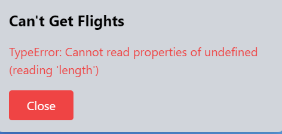

    

    
    
    
    
    

 

# Carleton University - Bootcamp

## Project 1: Traver Researcher
For our first project, we decided to build an application that would allow us (users) to plan our vacations, and search for flights -find the cheapest flights. In addition to the flights the application would allow us to book a hotel room in the destination city. Travel searches are to be stored in our Local Storage. The application makes use of at least two API's; one to retrieve Flights and the second one to retrieve hotels. This is a multiple page project designed in HTML, Javascript and Tailwind CSS platform.

Hope you enjoy it and here is out product!

<!-- ABOUT THE PROJECT -->
## About The Project

Building our first project was a very challenging, and not just because of the complexity of what we wanted to build, but because it had to be done in group. As students not all of use have had the chance to worked in real-life applications using the productivity tools, tools that we will probably use for a long time. We had to have standup meetings, review meeting, brainstorms and finally get our hands dirty with the code. We chose one of our members of the group to be our admin liason, in charge of the github online repository. He was in charge of making sure we all collaborated with our issues, he reviewed code and handle the documentation. Not an easy task either; we all have our own way of thinking and developing our coding styles.

The Travel Researcher, same as all our previous challenges, was developed using JavaScript, JQuery and API. Two APIs were used in this application:
* <a href="https://tequila.kiwi.com/portal/login">api.tequila.kiwi.com</a> - this API provides flights information. This is the documentation for the HTTP API provided by KIWI.KI GmbH for remote unlocking and administration of doors.
* <a href="https://developers.booking.com/api/index.html">dev.booking-com.p.rapidapi.com.net</a> - Hotels information, it searches for deals on hotels, homes, and much more...

### API Bad calls
APIs return a call status to the client which can be in the form of: a Success or Failure type call. In both the cases, it is necessary to let the client know so that they can proceed to the next step. It is innevitable that bad call would or will occure at some point, network connection, credentials, internet or even the API service status. Whatever the case we need to graciously fail the process. For that, we are using a Generic-purpose Modal (popup) form to communicate the error to the user. 

Depending on circumstances there may -or may not, be a solution to the failure.

(<a href="#readme-top">back to top</a>)

### Built With

The **Travel Researcher** has been built using plain *HTML* and several API and technologies. *Tailwind* CSS framework with it's large number of classes and pre-define elements such as cards and navbars. The application makes extensive use of Javascripts and JQuery.

Here are a few examples.

* [![JQuery][JQuery.com]][JQuery-url]
* [![Javascript]][Javascript-url]

### Team

The **Travel Researcher** was our coding bootcamp first project and therefore it had to be done in a team. Teams were created randomly by the teacher; team #2, our team was conformed by Sonja Gorin, Jacob Martin and Gustavo Miller. Among our team we distributed the workload and made the application possible, and had some coding fun in the process.

<!-- ROADMAP -->
## Roadmap

- [x] Initialize Travel Researcher
- [x] Create issues and assign to each developer
- [x] Create main branch: developing, all branches will be dependant from this.
- [x] Create branches from developing for the implementations; feature-mainscreen, feature-searchscreen, feature-hover, feature-corrections, feature-historyscreen, feature-hotelbookmarks
- [x] Test and Debug application

(<a href="#readme-top">back to top</a>)

## Issues
During our development we have added a number of issues, some of them created at initial design and then we added issue on-demand. It was **important** to keep these issue with as much information as possible. This was done this way in order to document not just the feature but also the progress of the coding. 

See the [open issues](https://github.com/gusmiller/Travel_Researcher/issues) for a full list of proposed features.

**Open Issues**
1. Feature-warningpopup
2. Feature-searching - Styling bookmarks
3. Feature-screen - CSS Styling
4. Feature-search - bookmark
5. Feature-hotels
6. Feature-search
7. Feature-mainscreen
8. Initial Meetings

**Closed issues**
1. Flight-search-column-order
2. Flight-search-no flights-edge-case
3. Flight-search-saving-flights
4. Flight-search-calendar
5. Feature searchscreen
6. Feature hover
7. Feature-corrections
8. Feature-hover
9. Add additonal tailwind css

**Bug**
1. Aviationstack not returning future flights

(<a href="#readme-top">back to top</a>)

## License

Distributed under the MIT License. See `LICENSE.txt` for more information.

<!-- MARKDOWN LINKS & IMAGES -->
[product-screenshot]: ./assets/images/weather001.png
[weatherFirstTime]: ./assets/images/weather002.png
[weatherError]: ./assets/images/weather003.png

[Bootstrap.com]: https://img.shields.io/badge/Bootstrap-563D7C?style=for-the-badge&logo=bootstrap&logoColor=white
[Bootstrap-url]: https://getbootstrap.com
[JQuery.com]: https://img.shields.io/badge/jQuery-0769AD?style=for-the-badge&logo=jquery&logoColor=white
[JQuery-url]: https://jquery.com

[Javascript]:https://img.shields.io/badge/JavaScript-F7DF1E?style=for-the-badge&logo=javascript&logoColor=black
[Javascript-url]:https://developer.mozilla.org/en-US/docs/Web/javascript